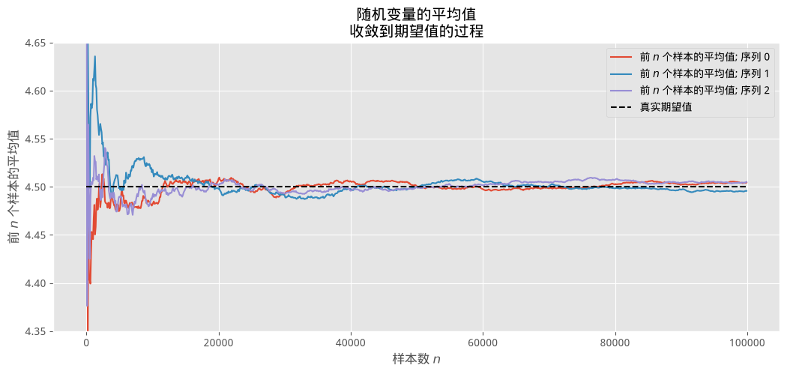
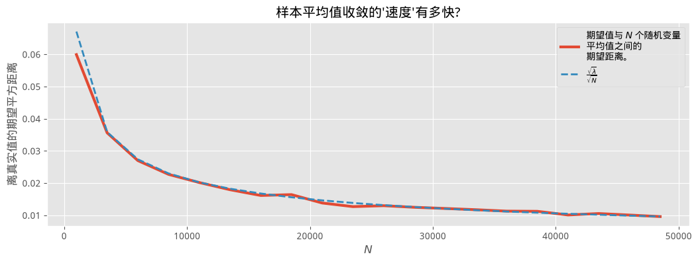
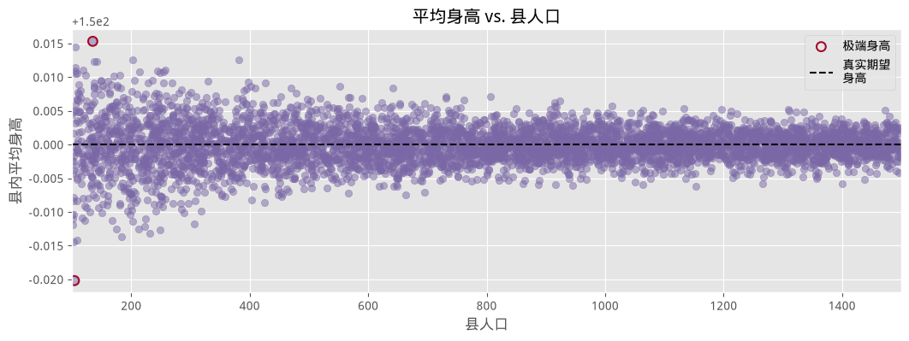
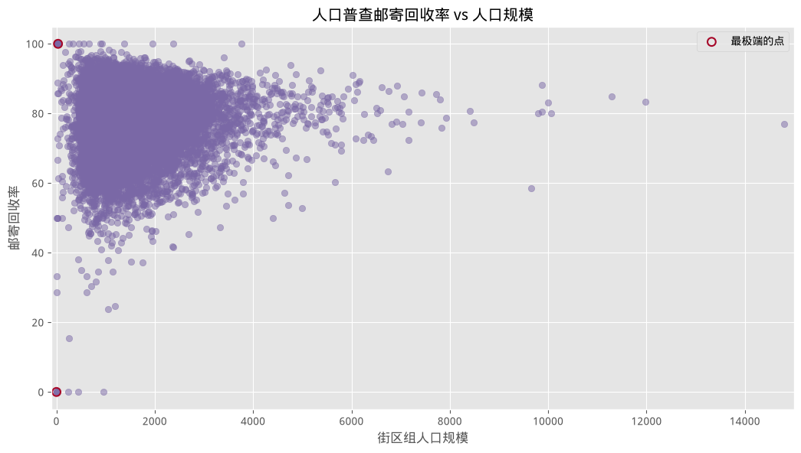
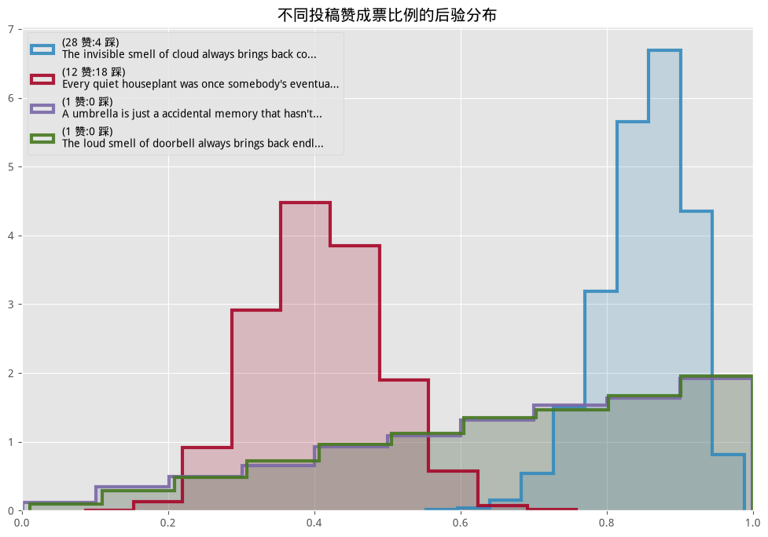
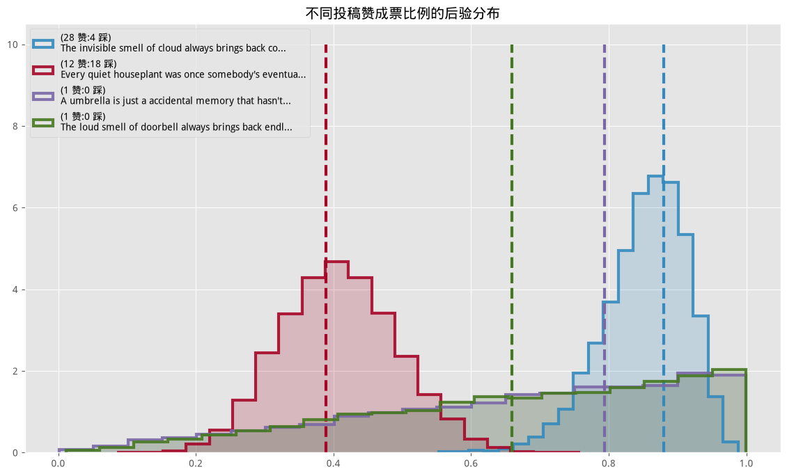
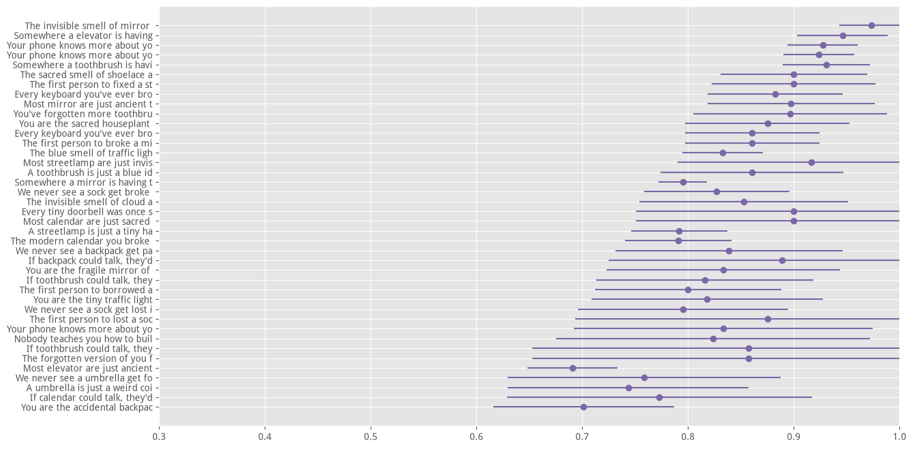

#+TITLE: 概率编程与贝叶斯方法(黑客版) — 第四章
#+LANGUAGE: zh-CN
#+OPTIONS: toc:3 num:2
#+STARTUP: showall

* 第四章

=原著: Cam Davidson-Pilon=

=Python 3 / PyMC3 移植: Max Margenot (@clean_utensils), Thomas Wiecki (@twiecki), Quantopian=

=PyMC (最新) 移植: Kurisu Chan (@miemiekurisu)=

=中文翻译、现代 PyMC (6.x) 适配与内容增补: 本 fork 维护者=

______

** 那个从未被明说的伟大定理

本章聚焦于一个始终在我们脑海中若隐若现、却很少在统计学专著之外被明确讲清楚的想法。事实上,在此之前的每一个例子里,我们其实都已经在悄悄使用这个简单的想法了。

*本章的现代 PyMC 修复说明*:原书用一个会实时访问 Reddit API 的脚本
(=top_showerthoughts_submissions.py=,依赖 =praw= 库和 Reddit API 凭据)来抓取
"如何给 Reddit 帖子排序"这个例子所需要的数据。这在没有联网、也没有配置
Reddit API 凭据的环境下(比如构建本仓库时所在的沙箱环境)必然会失败。
我们把它换成了 =showerthoughts_offline_data.py=——一个完全离线、
用固定随机种子生成的合成数据集,统计结构(点赞/点踩票数的偏态分布)刻意
模仿了真实 Reddit 数据的特征,但文本内容是清楚标注为*合成*的占位文本,
不是真实抓取的帖子,这样整份教程就能在完全离线的情况下端到端跑通,不会
向读者呈现看似真实、实则伪造的用户生成内容。

*** 大数定律

设 $Z_i$ 是取自某个概率分布的 $N$ 个独立样本。根据*大数定律*,只要期望值 $E[Z]$ 是有限的,下式就成立:

$$\frac{1}{N} \sum_{i=1}^N Z_i \rightarrow E[ Z ],  \;\;\; N \rightarrow \infty.$$

用大白话说:

#+BEGIN_QUOTE
一串来自同一分布的随机变量, 它们的平均值会收敛到该分布的期望值。
#+END_QUOTE

这个结果听起来可能有点无聊,但它会是你会用到的最有用的工具。

*** 直观理解

如果上面这条定律让你觉得有点意外,不妨通过一个简单的例子来把它讲清楚。

考虑一个只能取两个值 $c_1$ 和 $c_2$ 的随机变量 $Z$。假设我们有大量 $Z$ 的样本,把某个具体的样本记为 $Z_i$。这条定律说,我们可以通过对所有样本取平均,来近似 $Z$ 的期望值。考虑这个平均值:

$$ \frac{1}{N} \sum_{i=1}^N \;Z_i $$

根据构造,$Z_i$ 只能取 $c_1$ 或 $c_2$,所以我们可以把这个和按这两个取值拆开:

\begin{align}
\frac{1}{N} \sum/{i=1}^N \;Z/i
& =\frac{1}{N} \big(  \sum/{ Z/i = c/1}c/1 + \sum/{Z/i=c/2}c/2 \big) \\\\[5pt]
& = c/1 \sum/{ Z/i = c/1}\frac{1}{N} + c/2 \sum/{ Z/i = c/2}\frac{1}{N} \\\\[5pt]
& = c_1 \times \text{ ($c_1$ 的近似频率) } \\\\
& \;\;\;\;\;\;\;\;\; + c_2 \times \text{ ($c_2$ 的近似频率) } \\\\[5pt]
& \approx c/1 \times P(Z = c/1) + c/2 \times P(Z = c/2 ) \\\\[5pt]
& = E[Z]
\end{align}

在极限意义下等号成立,但只要在平均中使用越来越多的样本,我们就能越来越接近这个值。这条定律对*几乎任何分布*都成立,除了我们之后会遇到的几种重要的例外情形。

***** 示例
____

下面是三条不同的泊松随机变量序列,展示了大数定律实际运作的样子。

我们采样 =sample_size = 100000= 个参数为 $\lambda=4.5$ 的泊松随机变量(回忆一下,泊松随机变量的期望值就等于它的参数)。我们计算前 $n$ 个样本的平均值,$n$ 从 1 取到 =sample_size=。

#+BEGIN_SRC python

%matplotlib inline
import numpy as np
from IPython.core.pylabtools import figsize
import matplotlib.pyplot as plt
import matplotlib as mtl
mtl.style.use("ggplot")

figsize(12.5, 5)

sample_size = 100000
expected_value = lambda_ = 4.5
poi = np.random.poisson
N_samples = range(1, sample_size, 100)

for k in range(3):

    samples = poi(lambda_, sample_size)

    partial_average = [samples[:i].mean() for i in N_samples]

    plt.plot(N_samples, partial_average, lw=1.5, label="前 $n$ 个\
样本的平均值; 序列 %d" % k)

plt.plot(N_samples, expected_value * np.ones_like(partial_average),
         ls="--", label="真实期望值", c="k")

plt.ylim(4.35, 4.65)
plt.title("随机变量的平均值\n收敛到期望值的过程")
plt.ylabel("前 $n$ 个样本的平均值")
plt.xlabel("样本数 $n$")
plt.legend();
#+END_SRC

从上图可以清楚地看到,当样本量较小时,平均值的波动更大(对比一下平均值曲线一开始有多*锯齿状、上蹿下跳*,之后又变得多*平滑*)。三条路径最终都*逼近*了 4.5 这个值,只是随着 $N$ 增大,它们只是若即若离地徘徊在这个值附近。数学家和统计学家给这种"若即若离"起了另一个名字:收敛。

另一个很值得问的问题是:*我收敛到期望值的速度有多快?*让我们画一张新的图。对某个特定的 $N$,让我们把上面的试验重复成千上万次,计算我们平均而言离真实期望值有多远。但等等——*平均而言计算*?这不正好又是大数定律吗!举例来说,对某个特定的 $N$,我们关心的是这个量:

$$D(N) = \sqrt{ \;E\left[\;\; \left( \frac{1}{N}\sum_{i=1}^NZ_i  - 4.5 \;\right)^2 \;\;\right] \;\;}$$

上面这个公式可以理解为:对某个 $N$,(平均意义上)离真实值有多远(我们取平方根,是为了让这个量和随机变量的量纲保持一致)。既然上式本身就是一个期望值,我们同样可以用大数定律来近似它:与其对 $Z_i$ 取平均,我们可以多次计算下面这个量,再对它们取平均:

$$ Y_k = \left( \;\frac{1}{N}\sum_{i=1}^NZ_i  - 4.5 \; \right)^2 $$

把上面这个量计算很多次($N_Y$ 次,记住它本身是随机的),再取平均:

$$ \frac{1}{N_Y} \sum_{k=1}^{N_Y} Y_k \rightarrow E[ Y_k ] = E\;\left[\;\; \left( \frac{1}{N}\sum_{i=1}^NZ_i  - 4.5 \;\right)^2 \right]$$

最后,再开个根号:

$$ \sqrt{\frac{1}{N_Y} \sum_{k=1}^{N_Y} Y_k} \approx D(N) $$

#+BEGIN_SRC python

figsize(12.5, 4)

N_Y = 250  # 用这么多次来近似 D(N)
N_array = np.arange(1000, 50000, 2500)  # 用这么多样本来近似方差
D_N_results = np.zeros(len(N_array))

lambda_ = 4.5
expected_value = lambda_  # 对 X ~ Poi(lambda), E[X] = lambda

def D_N(n):
    '''
    这个函数近似 D_n, 即用 n 个样本时的平均方差。
    '''
    Z = poi(lambda_, (n, N_Y))
    average_Z = Z.mean(axis=0)
    return np.sqrt(((average_Z - expected_value) ** 2).mean())

for i, n in enumerate(N_array):
    D_N_results[i] = D_N(n)

plt.xlabel("$N$")
plt.ylabel("离真实值的期望平方距离")
plt.plot(N_array, D_N_results, lw=3,
         label="期望值与 $N$ 个随机变量\n平均值之间的\n期望距离。")
plt.plot(N_array, np.sqrt(expected_value) / np.sqrt(N_array), lw=2, ls="--",
         label=r"$\frac{\sqrt{\lambda}}{\sqrt{N}}$")
plt.legend()
plt.title("样本平均值收敛的'速度'有多快?");
#+END_SRC

正如预期的那样,样本平均值和真实期望值之间的期望距离,会随着 $N$ 增大而缩小。但也请注意,这个*收敛速度*在逐渐放缓:比如说,只需要多加 10000 个样本,就能让距离从 0.020 降到 0.015(降低了 0.005),但要再从 0.015 降到 0.010,却需要*再多* 20000 个样本(同样只降低了 0.005)。

事实证明,我们可以量出这个收敛速度。上图中我画了第二条曲线,函数 $\sqrt{\lambda}/\sqrt{N}$,这条曲线并不是随便选的。在大多数情况下,给定一串分布和 $Z$ 相同的随机变量,大数定律收敛到 $E[Z]$ 的速度是:

$$ \frac{ \sqrt{ \; Var(Z) \; } }{\sqrt{N} }$$

了解这一点很有用:对某个较大的 $N$,我们能知道(平均而言)自己离真实估计值有多远。另一方面,在贝叶斯的语境下,这个结果似乎显得有点鸡肋:贝叶斯分析本来就能容忍不确定性,那多要几位精确的数字有什么*统计*意义呢?不过,由于抽样本身的计算成本可能非常低,取一个*更大*的 $N$ 往往也无妨。

*** 那我们该怎么计算 $Var(Z)$ 呢?

方差本身也不过是另一个可以被近似的期望值罢了!考虑下面这个思路:一旦我们(借助大数定律)估计出了期望值,记为 $\mu$,我们就可以估计方差:

$$ \frac{1}{N}\sum_{i=1}^N \;(Z_i - \mu)^2 \rightarrow E[ \;( Z - \mu)^2 \;] = Var( Z )$$

*** 期望值与概率

期望值与概率估计之间还存在一种不那么直接的关系。定义*指示函数*:

$$\mathbb{1}_A(x) =
\begin{cases} 1 &  x \in A \\\\
              0 &  else
\end{cases}
$$

那么,根据大数定律,如果我们有很多样本 $X_i$,我们就可以用下式估计事件 $A$ 的概率 $P(A)$:

$$ \frac{1}{N} \sum_{i=1}^N \mathbb{1}_A(X_i) \rightarrow E[\mathbb{1}_A(X)] =  P(A) $$

稍加思索,这一点其实相当显然:指示函数只有在事件发生时才等于 1,所以我们其实是在统计事件发生的次数,再除以总的试验次数(想想我们通常是怎么用频率来近似概率的)。举例来说,假设我们想估计 $Z \sim Exp(.5)$ 大于 5 的概率,并且我们有很多来自 $Exp(.5)$ 分布的样本。

$$ P( Z > 5 ) =  \frac{1}{N}\sum_{i=1}^N \mathbb{1}_{z > 5 }(Z_i) $$

#+BEGIN_SRC python

N = 10000
print(np.mean([np.random.exponential(0.5) > 5 for i in range(N)]))
#+END_SRC

*** 这一切和贝叶斯统计有什么关系?

下一章即将介绍的*点估计*(point estimate),在贝叶斯推断中正是通过期望值来计算的。在更偏解析式的贝叶斯推断里,我们原本需要计算表示为多维积分的复杂期望值。现在不必了。如果我们能够直接从后验分布中采样,我们只需要计算平均值就够了,简单得多。如果对精度有要求,像上面那样的图可以告诉你收敛的速度有多快。如果还需要更高的精度,那就从后验分布中多取一些样本就是了。

那多少才算够呢?什么时候可以停止从后验分布中取样了?这是实践者自己需要做的决定,同时也取决于样本的方差(回忆一下上面提到的,方差越大,平均值收敛得越慢)。

我们还应该理解大数定律什么时候会失效。正如它的名字所暗示的,再对比一下上面 $N$ 较小时的图,这条定律只在样本量较大时才成立。没有这个前提,渐近结果就是不可靠的。了解在什么情况下这条定律会失效,能让我们对*该在什么时候保持不自信*更有信心。下一节就来讨论这个问题。

** 小数字带来的混乱

大数定律只有当 $N$ 趋于*无穷*时才严格成立——而这在现实中永远无法真正达到。虽然这条定律是一件强大的工具,但不加节制地滥用它却是很鲁莽的。下面的例子就说明了这一点。

***** 示例:聚合的地理数据

数据经常以聚合的形式出现。比如,数据可能是按州、县或市这一级分组统计的。当然,每个地理区域的人口数量各不相同。如果数据是每个地理区域某种特征的平均值,我们就必须留心大数定律,以及它在人口较少的区域会如何*失效*。

我们用一份玩具数据集来观察这一点。假设我们的数据集里有五千个县。此外,每个州(county)的人口数量在 100 到 1500 之间均匀分布。人口数字具体是怎么生成的和本次讨论无关,所以我们不做过多解释。我们关心的是测量每个县居民的平均身高。我们不知道的是,身高其实并*不会*因县而异,不论住在哪个县,每个人的身高都服从同一个分布:

$$ \text{身高} \sim \text{Normal}(150, 15 ) $$

我们把这些个体按县聚合起来,所以我们只拿得到*该县的平均值*。我们的数据集看起来会是什么样子呢?

#+BEGIN_SRC python

figsize(12.5, 4)
std_height = 15
mean_height = 150

n_counties = 5000
pop_generator = np.random.randint
norm = np.random.normal

# 生成一些人为的人口数字
population = pop_generator(100, 1500, n_counties)

average_across_county = np.zeros(n_counties)
for i in range(n_counties):
    # 生成一些个体, 并取平均值
    average_across_county[i] = norm(mean_height, 1. / std_height,
                                     population[i]).mean()

# 找出平均身高看起来最极端的那些县。
i_min = np.argmin(average_across_county)
i_max = np.argmax(average_across_county)

# 画出人口规模 vs. 记录到的平均身高
plt.scatter(population, average_across_county, alpha=0.5, c="#7A68A6")
plt.scatter([population[i_min], population[i_max]],
            [average_across_county[i_min], average_across_county[i_max]],
            s=60, marker="o", facecolors="none",
            edgecolors="#A60628", linewidths=1.5,
            label="极端身高")

plt.xlim(100, 1500)
plt.title("平均身高 vs. 县人口")
plt.xlabel("县人口")
plt.ylabel("县内平均身高")
plt.plot([100, 1500], [150, 150], color="k", label="真实期望\n身高", ls="--")
plt.legend(scatterpoints=1);
#+END_SRC

我们观察到了什么?*如果不考虑人口规模*,我们就会冒着犯下重大推断错误的风险:如果忽略人口规模,我们会认为图上圈出的那两个县,分别是身高最矮和最高的县。但这个推断是错误的,原因如下。这两个县*不一定*真的有最极端的身高。这个错误的根源在于:较小人口的计算平均值,并不能很好地反映真实的人口期望值(而真实值应当是 $\mu=150$)。样本量/人口规模/$N$,不管你怎么称呼它,都太小了,以至于没法有效地运用大数定律。

我们再补一条更有力的证据,来反驳这个推断。回忆一下,人口数字是在 100 到 1500 之间均匀分布的。凭直觉,我们应该认为,身高最极端的那些县,它们的人口规模也应该在 100 到 1500 之间均匀分布,并且和该县的人口规模无关。但事实并非如此。下面是身高最极端的那些县的人口规模。

#+BEGIN_SRC python

print("身高'最矮'的 10 个县的人口规模: ")
print(population[np.argsort(average_across_county)[:10]], '\n')
print("身高'最高'的 10 个县的人口规模: ")
print(population[np.argsort(-average_across_county)[:10]])
#+END_SRC

完全不是在 100 到 1500 之间均匀分布的。这正是大数定律彻底失效的一个例子。

***** 示例:Kaggle 的*美国人口普查回收率挑战赛*

下面是来自 2010 年美国人口普查的数据,它把人口进一步细分到了比"县"更小的"街区组"(block group,由若干个城市街区或等价单位聚合而成)一级。这份数据集来自我和几位同事参加过的一次 Kaggle 机器学习竞赛。比赛的目标是利用人口普查变量(收入中位数、街区组中女性人数、拖车营地数量、平均子女数量等),预测某个街区组通过邮寄方式回收人口普查表格的比例(取值在 0 到 100 之间)。下面我们画出人口普查回收率相对于街区组人口规模的散点图:

#+BEGIN_SRC python

figsize(12.5, 6.5)
data = np.genfromtxt("data/census_data.csv", skip_header=1,
                      delimiter=",")
plt.scatter(data[:, 1], data[:, 0], alpha=0.5, c="#7A68A6")
plt.title("人口普查邮寄回收率 vs 人口规模")
plt.ylabel("邮寄回收率")
plt.xlabel("街区组人口规模")
plt.xlim(-100, 15e3)
plt.ylim(-5, 105)

i_min = np.argmin(data[:, 0])
i_max = np.argmax(data[:, 0])

plt.scatter([data[i_min, 1], data[i_max, 1]],
            [data[i_min, 0], data[i_max, 0]],
            s=60, marker="o", facecolors="none",
            edgecolors="#A60628", linewidths=1.5,
            label="最极端的点")

plt.legend(scatterpoints=1);
#+END_SRC

上图是统计学中一个经典现象。我说*经典*,指的正是上面这张散点图的"形状"。它呈现出一种经典的三角形轮廓,随着样本量增大(大数定律变得越来越精确),这个三角形也会逐渐收窄。

我可能有点过分强调这一点了,也许这本书应该被叫做《你其实没有大数据问题!》,但这里又一次展示了*小数据集*(而不是大数据集)带来的麻烦。简单来说,小数据集是没法靠大数定律来处理的。对比一下,把大数定律毫无阻力地应用在大数据集上是多么轻松(比如真正的大数据)。我前面提到过,颇为矛盾的是,大数据的预测问题往往是靠相对简单的算法解决的。理解了大数定律会产生*稳定*的解——也就是说,增加或减少几个数据点,不会对解产生太大影响——这个矛盾就能得到部分的解释。反过来,在一个小数据集里增加或删除数据点,却可能带来截然不同的结果。

如果想进一步了解大数定律背后隐藏的风险,我强烈推荐这篇出色的文章:[[http://nsm.uh.edu/~dgraur/niv/TheMostDangerousEquation.pdf][The Most Dangerous Equation]]。

***** 示例: 如何给 Reddit 帖子排序

你可能会不同意开头那句话——"大数定律是每个人都知道的",只不过是在潜意识的决策过程中隐式地知道罢了。想想在线商品的评分:如果只有 1 个评价者给出平均 5 星好评,你会相信几分?2 个评价者呢?3 个呢?我们隐式地明白,评价者这么少的时候,平均评分*不能*很好地反映商品的真实价值。

这也导致了我们排序、乃至更广泛地比较各种条目时存在缺陷。很多人已经意识到,单纯按评分给在线搜索结果排序——不管对象是书籍、视频还是网络评论——效果往往很差。排在前面、看起来评分完美的视频或评论,常常只是被少数几个热情粉丝打出满分,而真正更优质的视频或评论,却可能因为大约 4.8 分这种*被低估的虚假低分*而被埋没在后面的页面里。我们要怎么纠正这个问题呢?

考虑一下大家熟知的 Reddit 网站(我刻意没有加链接,免得你一去不回)。这个网站上托管着各种链接到故事或图片的帖子,称为 submission(投稿),供人们评论。Redditor(Reddit 用户)可以为每条投稿投赞成票或反对票(称为 upvote 和 downvote)。Reddit 默认会按"热门"(Hot)给某个板块下的投稿排序,也就是最近获得最多赞成票的投稿排在前面。

那要怎么判断哪些投稿才是"最好"的呢?有几种方式可以做到这一点:

1. *人气*:如果一条投稿有很多赞成票,就认为它是好的。这个模型的问题在于,一条有几百个赞成票、但同时也有几千个反对票的投稿——虽然很*火爆*,但很可能更像是有争议,而不是真的"最好"。
2. *差值*:用赞成票和反对票的*差*。这解决了上面的问题,但没有考虑到投稿的时间性质。取决于投稿发布的时间,网站当时的流量可能高也可能低。差值法会让"顶部"投稿偏向那些在高流量时段发布的帖子,它们比不那么走运的投稿积累了更多赞成票,但未必真的更好。
3. *时间调整*:考虑用差值除以投稿发布的时长。这会得到一个*速率*,类似于"每秒差值"或"每分钟差值"。一个立刻能想到的反例是,如果我们用每秒计算,一条发布了 1 秒、有 1 个赞成票的投稿,会比一条发布了 100 秒、有 99 个赞成票的投稿排名更高。我们可以规定只考虑发布时长至少 $t$ 秒的投稿来避免这个问题,但 $t$ 取多少合适?这是否意味着比 $t$ 更年轻的投稿都不算好?我们最终还是在比较不稳定的量(新投稿)和稳定的量(旧投稿)。
4. *比例*:按赞成票占总票数(赞成票加反对票)的比例来排序投稿。这解决了时间性的问题,只要新投稿的赞成票占比够高,也能和老投稿一样被视为"顶部"。这里的问题是,一条只有一个赞成票的投稿(比例 = 1.0),会打败一条有 999 个赞成票、1 个反对票的投稿(比例 = 0.999),但显然后者*更可能*是更好的投稿。

我用了*更可能*这个说法,是有原因的。确实存在这样的可能:前者那条只有一个赞成票的投稿,实际上比后者那条有 999 个赞成票的投稿更好。我们之所以不愿轻易认同这一点,是因为我们还没看到前者剩下那 999 张潜在投票会是什么样子。也许它会再获得 999 个赞成票、0 个反对票,从而被认为比后者更好,不过这不太可能。

我们真正想要的,是对*真实赞成票比例*的一个估计。请注意,真实赞成票比例和观测到的赞成票比例并不是一回事:真实比例是隐藏的,我们只能观测到赞成票与反对票的数量(可以把真实赞成票比例理解为"这条投稿获得赞成票、而不是反对票的底层概率是多少")。所以那条 999 赞成/1 反对的投稿,真实赞成票比例很可能接近 1,得益于大数定律,我们可以有把握地这样断言;但另一方面,对那条只有一个赞成票的投稿,我们对它真实赞成票比例的把握就小得多。在我看来,这听起来就是一个贝叶斯问题。

一种确定赞成票比例先验的方法,是查看历史上赞成票比例的分布。这可以通过抓取 Reddit 的投稿数据、统计出一个分布来实现。不过这种方法存在一些问题:

1. 数据偏态:绝大多数投稿的票数都非常少,因此会有大量投稿的比例扎堆在极端值附近(参见上面 Kaggle 数据集里的"三角形图"),这会把我们的分布严重地拉向极端。我们可以尝试只使用票数超过某个阈值的投稿,但这又会遇到新的问题:可用投稿数量和更高阈值(对应更精确的比例)之间存在权衡取舍。
2. 数据有偏:Reddit 由许多不同的子板块(subreddit)组成。举两个例子,*r/aww* 发布可爱动物的图片,而 *r/politics* 则是政治话题。这两个板块下用户对投稿的行为很可能截然不同:前者的访客大概率更友善、更容易被萌化,因此会给更多投稿点赞;而后者的投稿更可能引发争议和分歧。所以并非所有投稿都是等价可比的。

有鉴于此,我认为用 =Uniform= 先验会更合适。

有了先验之后,我们就可以求出真实赞成票比例的后验分布。Python 脚本 =top_showerthoughts_submissions.py= 会抓取 Reddit =showerthoughts= 板块里最好的帖子。这是一个纯文字板块,所以每条帖子的标题本身*就是*正文。下面是排名靠前的一条帖子,以及一些其他的样例帖子:

*本中文·现代 PyMC 版说明*:如前所述,我们把原来这个联网抓取脚本换成了 =showerthoughts_offline_data.py=——一个统计结构相仿、但内容是清楚标注为合成的离线数据集,这样例子依然能完整跑通,同时不会假冒真实抓取的 Reddit 内容。

#+BEGIN_SRC python

# 离线合成数据集, 替代原书里联网抓取 Reddit 的 %run top_showerthoughts_submissions.py 2
'''
contents: 一个数组, 保存(离线合成的)"最近 100 条热门投稿"的文本
votes: 一个二维 NumPy 数组, 每条投稿的赞成票数与反对票数
'''
from showerthoughts_offline_data import load
top_post, contents, votes = load()

print("Post contents: \n")
print(top_post)
#+END_SRC

#+BEGIN_SRC python

n_submissions = len(votes)
submissions = np.random.randint(n_submissions, size=4)
print("部分投稿样例(共 %d 条) \n-----------" % n_submissions)
for i in submissions:
    print('"' + contents[i] + '"')
    print("赞成票/反对票: ", votes[i, :], "\n")
#+END_SRC

对给定的真实赞成票比例 $p$ 和 $N$ 张投票,赞成票的数量看起来就像一个参数为 $p$、$N$ 的二项随机变量(这是因为赞成票比例和"在 $N$ 张可能的投票/试验中投赞成票 vs. 反对票的概率"是等价的)。我们写一个函数,针对某条投稿的赞成票/反对票数据,对 $p$ 执行贝叶斯推断。

#+BEGIN_SRC python

import pymc as pm

def posterior_upvote_ratio(upvotes, downvotes, samples=15000):
    '''
    这个函数接收某条投稿收到的赞成票数、反对票数,以及希望返回给用户
    的后验样本数。假设先验是均匀分布。
    '''
    N = upvotes + downvotes
    with pm.Model() as model:
        upvote_ratio = pm.Uniform("upvote_ratio", 0, 1)
        observations = pm.Binomial("obs", N, upvote_ratio, observed=upvotes)

        trace = pm.sample(samples, step=pm.NUTS(), tune=5000, chains=1)

    return trace.posterior.upvote_ratio.data.T
#+END_SRC

下面是得到的后验分布。

#+BEGIN_SRC python

figsize(12., 8)
posteriors = []
colours = ["#348ABD", "#A60628", "#7A68A6", "#467821", "#CF4457"]
for i in range(len(submissions)):
    j = submissions[i]
    posteriors.append(posterior_upvote_ratio(votes[j, 0], votes[j, 1]))
    plt.hist(posteriors[i], bins=10, density=True, alpha=.9,
             histtype="step", color=colours[i % 5], lw=3,
             label='(%d 赞:%d 踩)\n%s...' % (votes[j, 0], votes[j, 1], contents[j][:50]))
    plt.hist(posteriors[i], bins=10, density=True, alpha=.2,
             histtype="stepfilled", color=colours[i], lw=3, )

plt.legend(loc="upper left")
plt.xlim(0, 1)
plt.title("不同投稿赞成票比例的后验分布");
#+END_SRC

有些分布非常集中,另一些则(相对而言)有很长的尾巴,反映出我们对真实赞成票比例究竟是多少的不确定程度。

*** 排序!

我们一直没提这个练习真正的目标:该如何把投稿从*最好排到最差*?当然,我们没法直接对分布排序,必须排的是标量数字。把一个分布浓缩成一个标量的方法有很多:用期望值(也就是均值)来代表这个分布是其中一种。但选均值其实不太好,因为均值没有考虑到分布的不确定性。

我建议使用*95% 最不乐观取值*(95% least plausible value),定义为:真实参数低于这个值的概率只有 5%(可以把它想象成 95% 可信区间的下界)。下面画出了后验分布,以及标出的 95% 最不乐观取值:

#+BEGIN_SRC python

figsize(14., 8)
N = posteriors[0].shape[0]
lower_limits = []

for i in range(len(submissions)):
    j = submissions[i]
    plt.hist(posteriors[i], bins=20, density=True, alpha=.9,
             histtype="step", color=colours[i], lw=3,
             label='(%d 赞:%d 踩)\n%s...' % (votes[j, 0], votes[j, 1], contents[j][:50]))
    plt.hist(posteriors[i], bins=20, density=True, alpha=.2,
             histtype="stepfilled", color=colours[i], lw=3, )
    v = np.sort(posteriors[i])[int(0.05 * N)]
    # plt.vlines(v, 0, 15, color="k", alpha=1, linewidths=3)
    plt.vlines(v, 0, 10, color=colours[i], linestyles="--", linewidths=3)
    lower_limits.append(v)
    plt.legend(loc="upper left")

plt.legend(loc="upper left")
plt.title("不同投稿赞成票比例的后验分布");
order = np.argsort(-np.array(lower_limits))
print(order, lower_limits)
#+END_SRC

根据我们这套方法,最好的投稿,是那些*最有可能*获得高赞成票比例的投稿。直观地看,就是那些 95% 最不乐观取值最接近 1 的投稿。

为什么按这个量排序是个好主意?因为按 95% 最不乐观取值排序,相当于我们在"什么是最好的"这个判断上采取了最保守的态度。当我们使用 95% 可信区间的下界时,我们高度确信"真实赞成票比例"至少不会低于这个值(甚至可能更高),从而确保真正最好的投稿依然会排在前面。在这套排序方式下,我们施加了以下几条非常自然的性质:

1. 给定两条观测到的赞成票比例相同的投稿,票数更多的那条会被判定为更好(因为我们更有信心它的比例确实更高)。
2. 给定两条票数相同的投稿,赞成票更多的那条依然会被判定为*更好*。

*** 但这对实时场景来说太慢了!

我同意,给每条投稿都计算一次后验分布非常耗时,而且等你算完的时候,数据很可能已经变了。我把相关数学推导留到附录,这里直接给出一个能非常快速地计算下界的公式:

$$ \frac{a}{a + b} - 1.65\sqrt{ \frac{ab}{ (a+b)^2(a + b +1 ) } }$$

其中

\begin{align}
& a = 1 + u \\\\
& b = 1 + d \\\\
\end{align}

$u$ 是赞成票数,$d$ 是反对票数。这个公式是贝叶斯推断里的一个捷径,我们会在第六章讨论先验时更详细地解释它。

#+BEGIN_SRC python

def intervals(u, d):
    a = 1. + u
    b = 1. + d
    mu = a / (a + b)
    std_err = 1.65 * np.sqrt((a * b) / ((a + b) ** 2 * (a + b + 1.)))
    return (mu, std_err)

print("近似下界:")
posterior_mean, std_err = intervals(votes[:, 0], votes[:, 1])
lb = posterior_mean - std_err
print(lb)
print("\n")
print("按近似下界排序的前 40 名:")
print("\n")
order = np.argsort(-lb)
ordered_contents = []
for i in order[:40]:
    ordered_contents.append(contents[i])
    print(votes[i, 0], votes[i, 1], contents[i])
    print("-------------")
#+END_SRC

我们可以画出后验均值和边界,并按下界排序,来直观地看出这个排序结果。在下图中,注意左侧的误差棒是排好序的(正如我们建议的,这是判断排序的最佳方式),所以用圆点标出的均值本身并不遵循什么明显的规律。

#+BEGIN_SRC python

r_order = order[::-1][-40:]
plt.errorbar(posterior_mean[r_order], np.arange(len(r_order)),
             xerr=std_err[r_order], capsize=0, fmt="o",
             color="#7A68A6")
plt.xlim(0.3, 1)
plt.yticks(np.arange(len(r_order) - 1, -1, -1), map(lambda x: x[:30].replace("\n", ""), ordered_contents));
#+END_SRC

从上面这张图可以看出,为什么按均值排序不是一个好的选择。

*** 推广到星级评分系统

上面这套流程对赞成票/反对票的场景很有效,但对使用星级评分的系统(比如 5 星评分)呢?同样的问题也适用于简单取平均:一件只有两个满分好评的商品,会打败一件有成千上万个满分好评、但只有一个不完美评价的商品。

我们可以把上面赞成票/反对票的问题看作二元的:0 表示反对票,1 表示赞成票。一个 $N$ 星评分系统可以看作是上面问题的连续版本,我们可以设"给了 $n$ 颗星"等价于给了 $\frac{n}{N}$ 的奖励。比如,在 5 星系统里,2 星对应 0.4。满分对应 1。我们可以用和之前一样的公式,只是 $a, b$ 的定义要变一下:

$$ \frac{a}{a + b} - 1.65\sqrt{ \frac{ab}{ (a+b)^2(a + b +1 ) } }$$

其中

\begin{align}
& a = 1 + S \\\\
& b = 1 + N - S \\\\
\end{align}

其中 $N$ 是打分的用户数,$S$ 是所有评分之和(按上面提到的等价方式换算)。

***** 示例: 统计 Github 星标数

一个 Github 仓库平均有多少个星标?该怎么计算这个量?Github 上有超过 600 万个仓库,数据量完全足够用来运用大数定律。让我们开始拉取一些数据吧。(待补充)

*** 结论

大数定律虽然很酷,但正如它的名字所暗示的,它只有在样本量*足够大*时才成立。我们已经看到了,不考虑*数据的形态*会如何影响我们的推断。

1. 通过(廉价地)从后验分布中抽取大量样本,我们可以确保在近似期望值时,大数定律是适用的(这正是我们下一章要做的事)。

2. 贝叶斯推断明白,在样本量较小时,我们可能会观测到剧烈的随机性。我们的后验分布会通过更分散(而不是紧密集中)的形态来反映这一点。因此我们的推断本身就应该是可以自我修正的。

3. 不考虑样本量会带来严重的后果,试图对不稳定的对象排序,会导致病态的排序结果。上面提供的方法解决了这个问题。

*** 附录

***** 投稿排序公式的推导

我们本质上是在用一个 Beta 先验(参数 $a=1, b=1$,也就是均匀分布),再配合观测数据 $u, N=u+d$ 的二项似然。这意味着我们的后验是一个参数为 $a' = 1+u, b'=1+(N-u)=1+d$ 的 Beta 分布。接下来我们需要求出这样一个值 $x$,使得取值小于 $x$ 的概率恰好是 0.05。这通常是通过对 CDF([[http://en.wikipedia.org/wiki/Cumulative/Distribution/Function][累积分布函数]])求逆来完成的,但对整数参数的 Beta 分布来说,虽然它的 CDF 是已知的,却是一个相当庞大的求和式 [3]。

我们改用正态近似来代替。Beta 分布的均值是 $\mu = a'/(a'+b')$,方差是

$$\sigma^2 = \frac{a'b'}{ (a' + b')^2(a'+b'+1) }$$

因此我们通过求解下面这个方程来得到近似下界:

$$ 0.05 = \Phi\left( \frac{(x - \mu)}{\sigma}\right) $$

其中 $\Phi$ 是[[http://en.wikipedia.org/wiki/Normal/distribution#Cumulative/distribution][正态分布的累积分布函数]]。

***** 习题

1. 你会如何估计 $E\left[ \cos{X} \right]$ 这个量,其中 $X \sim \text{Exp}(4)$?那 $E\left[ \cos{X} | X \lt 1\right]$ 呢,也就是*已知* $X$ 小于 1 时的期望值?为了达到相同的精度,你需要比原来更多的样本吗?

#+BEGIN_SRC python

## 在这里写代码
import scipy.stats as stats
exp = stats.expon(scale=4)
N = 1e5
X = exp.rvs(int(N))
## ...
#+END_SRC

2. 下面这张表格出自论文《Going for Three: Predicting the Likelihood of Field Goal Success with Logistic Regression》[2]。这张表按不失误百分比,给橄榄球射门球员排了名。研究者犯了什么错误?

-----

**** 按射门成功率排名的球员生涯数据
<table><tbody><tr><th>排名</th><th>球员</th><th>成功率 %</th><th>射门次数</th></tr><tr><td>1 </td><td>Garrett Hartley </td><td>87.7 </td><td>57</td></tr><tr><td>2</td><td> Matt Stover </td><td>86.8 </td><td>335</td></tr><tr><td>3 </td><td>Robbie Gould </td><td>86.2 </td><td>224</td></tr><tr><td>4 </td><td>Rob Bironas </td><td>86.1 </td><td>223</td></tr><tr><td>5</td><td> Shayne Graham </td><td>85.4 </td><td>254</td></tr><tr><td>… </td><td>… </td><td>…</td><td> </td></tr><tr><td>51</td><td> Dave Rayner </td><td>72.2 </td><td>90</td></tr><tr><td>52</td><td> Nick Novak </td><td>71.9 </td><td>64</td></tr><tr><td>53 </td><td>Tim Seder </td><td>71.0 </td><td>62</td></tr><tr><td>54 </td><td>Jose Cortez </td><td>70.7</td><td> 75</td></tr><tr><td>55 </td><td>Wade Richey </td><td>66.1</td><td> 56</td></tr></tbody></table>

2013 年 8 月,一篇关于不同编程语言程序员平均收入的[[http://bpodgursky.wordpress.com/2013/08/21/average-income-per-programming-language/][热门文章]]曾经风靡一时。这是它的汇总图表(未经许可转载,毕竟用统计数字撒谎,迟早是要挨"锤"的):你从两端的极端值里注意到了什么?

-----

**** 按编程语言划分的家庭平均收入

<table >
 <tr><td>语言</td><td>家庭平均收入 ($)</td><td>数据点数</td></tr>
 <tr><td>Puppet</td><td>87,589.29</td><td>112</td></tr>
 <tr><td>Haskell</td><td>89,973.82</td><td>191</td></tr>
 <tr><td>PHP</td><td>94,031.19</td><td>978</td></tr>
 <tr><td>CoffeeScript</td><td>94,890.80</td><td>435</td></tr>
 <tr><td>VimL</td><td>94,967.11</td><td>532</td></tr>
 <tr><td>Shell</td><td>96,930.54</td><td>979</td></tr>
 <tr><td>Lua</td><td>96,930.69</td><td>101</td></tr>
 <tr><td>Erlang</td><td>97,306.55</td><td>168</td></tr>
 <tr><td>Clojure</td><td>97,500.00</td><td>269</td></tr>
 <tr><td>Python</td><td>97,578.87</td><td>2314</td></tr>
 <tr><td>JavaScript</td><td>97,598.75</td><td>3443</td></tr>
 <tr><td>Emacs Lisp</td><td>97,774.65</td><td>355</td></tr>
 <tr><td>C#</td><td>97,823.31</td><td>665</td></tr>
 <tr><td>Ruby</td><td>98,238.74</td><td>3242</td></tr>
 <tr><td>C++</td><td>99,147.93</td><td>845</td></tr>
 <tr><td>CSS</td><td>99,881.40</td><td>527</td></tr>
 <tr><td>Perl</td><td>100,295.45</td><td>990</td></tr>
 <tr><td>C</td><td>100,766.51</td><td>2120</td></tr>
 <tr><td>Go</td><td>101,158.01</td><td>231</td></tr>
 <tr><td>Scala</td><td>101,460.91</td><td>243</td></tr>
 <tr><td>ColdFusion</td><td>101,536.70</td><td>109</td></tr>
 <tr><td>Objective-C</td><td>101,801.60</td><td>562</td></tr>
 <tr><td>Groovy</td><td>102,650.86</td><td>116</td></tr>
 <tr><td>Java</td><td>103,179.39</td><td>1402</td></tr>
 <tr><td>XSLT</td><td>106,199.19</td><td>123</td></tr>
 <tr><td>ActionScript</td><td>108,119.47</td><td>113</td></tr>
</table>

*** 参考文献

1. Wainer, Howard. *The Most Dangerous Equation*. American Scientist, Volume 95.
2. Clarck, Torin K., Aaron W. Johnson, and Alexander J. Stimpson. "Going for Three: Predicting the Likelihood of Field Goal Success with Logistic Regression." (2013).
3. http://en.wikipedia.org/wiki/Beta/function#Incomplete/beta_function

